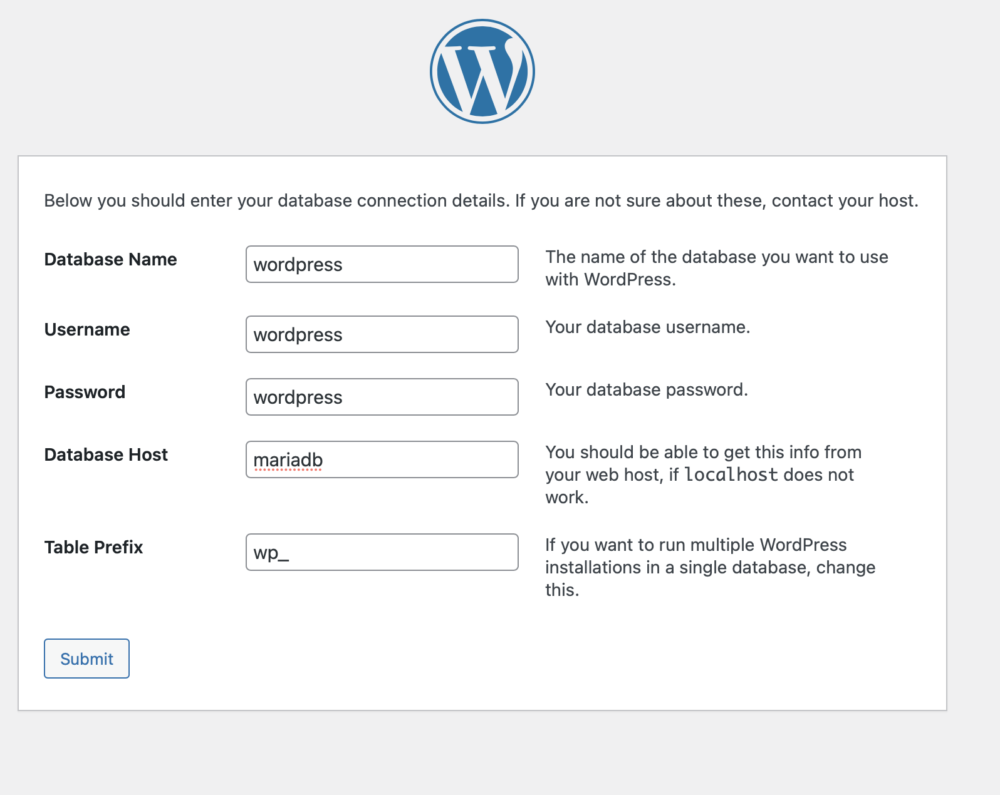

# WORDPRESS

1. Assurez-vous que vous avez correctement installé docker avec docker-compose
2. Télécharger wordpress [ici](https://wordpress.org/download/)
3. Une fois qu'il a été téléchargé et extrait, il doit être placé dans le fichier `www`
4. Une fois que c'est fait, renommez le dosier `wordpress` en `html`, comme dans l'image suivante


5. Lancer :
        ``` 
        docker-compose up -d 
        ```
6. Allez à http://localhost
7. Enjoy

### PD: Pour se connecter correctement à la base de données à partir de wordpres, vous devez placer les données de la façon suivante 



Dans le host nous ne mettons pas localhost, mais le nom du conteneur où nous avons mariadb car il se réfère à l'ip où il est exécuté.