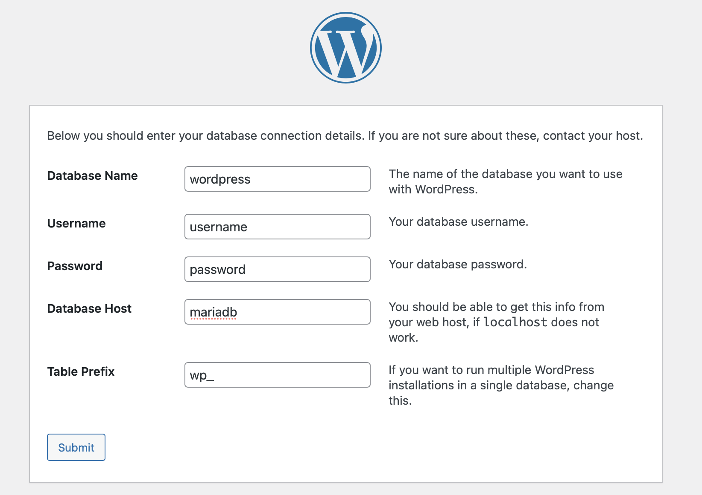

# WORDPRESS

1. Assurez-vous que vous avez correctement installé docker avec docker-compose
2. Télécharger wordpress [ici](https://wordpress.org/download/)
3. Une fois qu'il a été téléchargé et extrait, il doit être placé dans le fichier `www`
4. Une fois que c'est fait, renommez le dosier `wordpress` en `html`, comme dans l'image suivante


5. Lancer :
        ``` 
        docker compose up -d 
        ```
6. Allez à http://localhost
7. Enjoy

### Connexion à la base de données

Il y a deux façons de définir le host à l'étape de la connexion à la base de données dans wordpress la plus compliquée et la plus simple, je recommande la plus simple d'entre elles.

1. Connexion directe
- Dans ce cas, il suffit de placer le nom du conteneur dans le host de la connexion à la base de données dans wordpress, comme dans l'image suivante:
        <br/><br/><br/><br/>
- Cela fonctionne parce que le nom du conteneur est identique au nom de host, c'est-à-dire que tout comme `127.0.0.1` est égal à `localhost`, le nom du conteneur (`mariadb`) est égal à son adresse IP respective, qui change à chaque fois que le service est redémarré.


2. Récupérer manuellement l'adresse ip du conteneur mariadb de la manière suivante:
- Ouvrir un terminal
- Faites la commande `docker ps`, vous montrera de brèves informations sur tous les conteneurs en cours d'exécution
- Ensuite, vous devrez récupérer l'identifiant du conteneur dans lequel mariadb s'exécute. Comme dans l'image suivante:
        <br/><br/><br/><br/>
- Une fois que l'id de mariadb a été identifié, la commande suivante qui doit être exécutée c'est:
 ```
 docker inspect <id container mariadb> | grep IPAddress
  ```
- En suivant l'exemple de l'image ci-dessus, dans mon cas, ce serait: 
 ```
 docker inspect 110f4910afac | grep IPAddress
  ```
- En conséquence, vous aurez quelque chose comme:
        <br/><br/> <br/><br/>
- Et cette adresse IP est celle que vous allez mettre dans le host de la page connexion a la base de donnees wordpress:
        <br/><br/><br/><br/>
- Le problème se pose lorsque l'on relance les services. En effet, l'adresse IP du conteneur Mariadb a été modifiée et vous devez à nouveau définir la configuration. C'est pourquoi je recommande la première méthode.